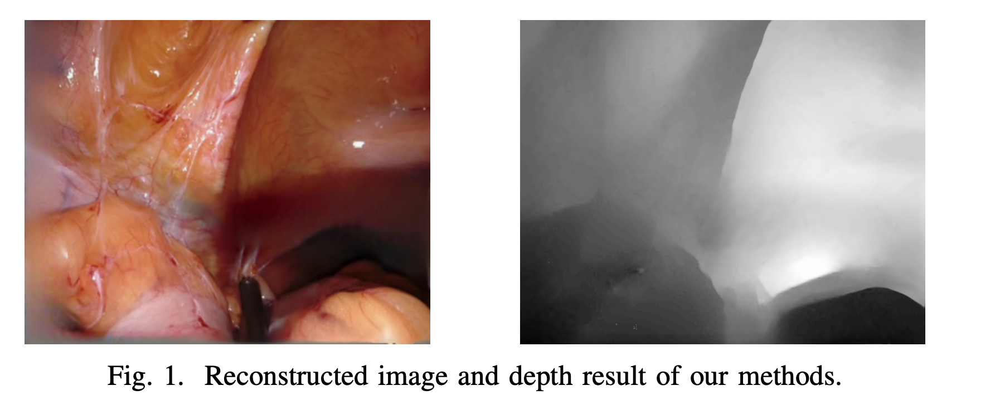

# EndoGaussians: Single View Dynamic Gaussian Splatting for Deformable Endoscopic Tissues Reconstruction

Official code for https://arxiv.org/abs/2401.13352



<!--  -->

## Installation
```
git clone https://github.com/yangsenchen/EndoGaussians.git
conda env create --file environment.yml
conda activate gs
pip install git+https://github.com/ingra14m/depth-diff-gaussian-rasterization.git
```